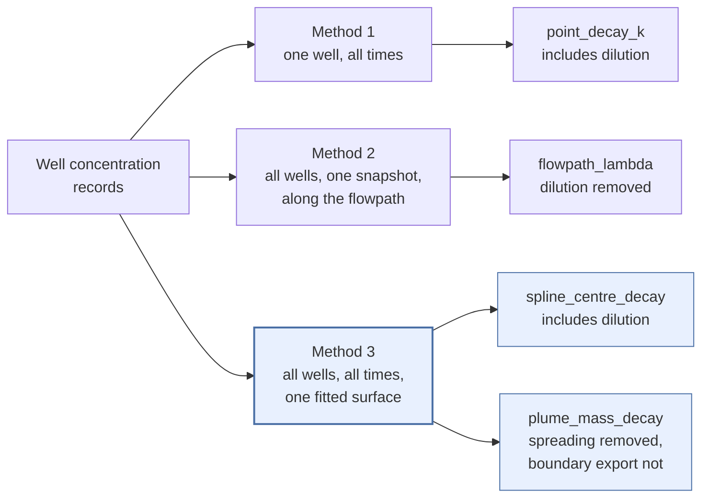
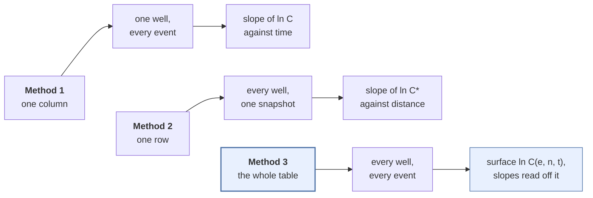
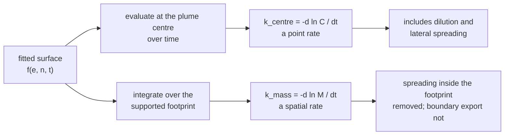
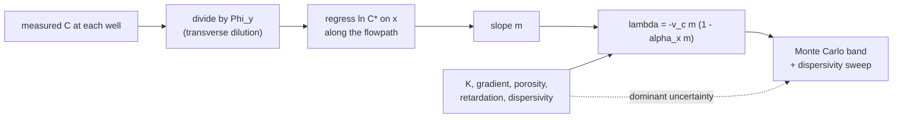

# The statistics behind three rate estimators

*Technical note for Wayne Jones, September 2026. Companion to the code in `biodeg_rates/`.*

A single monitoring well sampled quarterly for eight years yields ~32 numbers, and from those 32
numbers a consultant is routinely asked to produce one first-order rate constant that will carry a
closure schedule for the next two decades. The arithmetic of that request is what this note is
about. We estimate the rate three ways, the three ways return different numbers, and I want to set
out exactly what each one is doing statistically so you can judge where our approach is sound and
where it is thin.

The organising problem is that a concentration decline at a well has at least four causes: (i)
biological and chemical destruction, (ii) dilution and dispersion, (iii) sorption onto the aquifer
matrix, and (iv) depletion of the source itself. A rate constant fitted to concentrations lumps all
four together unless something in the method removes one. Hence we do not report a biodegradation
rate. We report estimands, i.e. named quantities that state which of those four causes they contain,
and we refuse to average across them because a mean of two different physical quantities is not a
measurement of anything.

Three methods, four estimands, because Method 3 reads two different quantities off the same fitted
surface. Method 3 is where most of our recent work has gone and where I most want your eye, so it
comes first.

---

## Method 3: a spatio-temporal penalized spline

### The data geometry

Methods 1 and 2 each throw away one axis of the data. Method 1 takes one well and uses its full time
history, ignoring every other well. Method 2 takes every well but collapses time to a single
representative snapshot. Method 3 keeps both axes, treating the record as ~126 observations
scattered in a three-dimensional volume of easting, northing and time, and fits one smooth surface
through the whole volume.

### The model

Let $y_i = \ln C_i$ be the log concentration of observation $i$ at easting $e_i$, northing $n_i$ and
time $t_i$ in years. We model the log surface as a tensor product of three cubic B-spline bases:

$$
f(e, n, t) \;=\; \sum_{a=1}^{K_E}\sum_{b=1}^{K_N}\sum_{c=1}^{K_T} \theta_{abc}\, B_a(e)\, B_b(n)\, B_c(t)
$$

Working in logs matters for two reasons. Concentrations are positive and roughly log-normal, so the
residual structure is better behaved on the log scale; and a first-order rate constant is by
definition a slope in log space, which means the quantity we want is read directly off the fitted
surface rather than recovered through a transformation.

Stacking the coefficients into a vector $\theta$ and the products of basis functions into a design
matrix $B$, the surface at the observations is $B\theta$. The basis counts are chosen from the data
rather than fixed: $K_E = K_N \approx \sqrt{n_{\text{wells}}} + 1$ capped at 8, and $K_T$ is the
number of sampling events capped at 6, with the whole product shrunk until $K_E K_N K_T \le 0.7n$.
A site with 14 wells and 9 events therefore lands on a 4 x 4 x 4 basis, i.e. 64 coefficients for 126
observations, which is tractable because of the penalty described next.

### The penalty, and why it is anisotropic

An unpenalized fit with 96 coefficients on 126 observations would interpolate the noise. We add a
second-order difference penalty on the coefficients along each axis, which penalizes curvature and
leaves a linear trend unpenalized:

$$
\hat{\theta} \;=\; \arg\min_{\theta}\; \lVert y - B\theta \rVert^2 \;+\; \theta^{\mathsf T} S(\lambda)\, \theta,
\qquad
S(\lambda) \;=\; \lambda_E P_E + \lambda_N P_N + \lambda_T P_T
$$

with $P = D_2^{\mathsf T} D_2$ for the second-difference operator $D_2$, expanded to the full
coefficient grid by Kronecker products. The solution is a penalized ridge:

$$
\hat{\theta} \;=\; \left(B^{\mathsf T}B + S(\lambda)\right)^{-1} B^{\mathsf T} y
$$

The three smoothing parameters are separate, and that is a deliberate choice rather than a detail.
Easting and northing are measured in metres, time is measured in years, and a single smoothing
parameter would force the model to be as smooth over 30 m as over 30 years. Because the second-order
penalty leaves linearity in its null space, driving $\lambda_T \to \infty$ collapses the time axis
to an exponential decay while the spatial structure stays free, which is exactly the behaviour we
want at a site with a clean decline and a messy footprint.

### Choosing the smoothing by REML

We select $\lambda$ by restricted maximum likelihood (REML), minimising

$$
\ell_R(\rho) \;=\; \tfrac{1}{2}\Big[(n - M_0)\log \hat{\sigma}^2 \;+\; \log\lvert B^{\mathsf T}B + S \rvert \;-\; \log\lvert S \rvert_{+}\Big],
\qquad \rho = \log \lambda
$$

where $\hat{\sigma}^2 = (\text{RSS} + \hat{\theta}^{\mathsf T} S \hat{\theta}) / (n - M_0)$, $M_0$
is the dimension of the penalty null space, and $\lvert S \rvert_{+}$ is the product of the positive
eigenvalues. Optimisation runs a coarse grid over $\rho$ followed by Nelder-Mead.

REML rather than generalised cross-validation (GCV) is the choice I would defend hardest. GCV is
known to undersmooth, and its objective is often nearly flat near the optimum, so on a sparse
monitoring network it can select a wiggly surface that fits sampling noise and then reports a rate
constant driven by that wiggle. REML treats the penalized coefficients as random effects and is the
more stable criterion on the ~10 to 30 wells a real site provides. We still compute GCV at the REML
optimum and report the gap between the two selections; when that gap exceeds 4 log units the
estimate carries a note that the smoothing choice is not well determined, which usually means
spatio-temporal correlation the model has not captured.

That flag fires on our own synthetic fixture, where the gap runs to ~21 log units. The two criteria
disagree sharply about how much to smooth a 14-well plume even when the data were generated by a
clean separable model, which tells you how weakly the smoothing parameter is identified at the well
counts we actually work with, and it is a reason to treat any single fitted surface as one plausible
surface rather than the surface.

Effective degrees of freedom, $\text{EDF} = \operatorname{tr}\!\big[(B^{\mathsf T}B + S)^{-1} B^{\mathsf T}B\big]$,
is reported with every fit. On that fixture the surface uses 21.3 effective degrees of freedom out
of 64 nominal coefficients, which is the number to look at when someone asks whether the fit is
interpolating noise.

### Two estimands off one surface

**The centre rate.** Evaluate the fitted surface at the source location $(e_0, n_0)$ across the
observed years and take the slope:

$$
k_{\text{centre}} \;=\; -\,\operatorname{TS}_t\big[\hat{f}(e_0, n_0, t)\big]
$$

where $\operatorname{TS}$ is the Theil-Sen slope, i.e. the median of all pairwise slopes. This
measures the same physical quantity as Method 1, but read off a surface informed by every well and
every event rather than from one noisy hydrograph.

**The mass rate.** Integrate the exponentiated surface over the plume footprint at each time, then
take the slope of the log of that integral:

$$
M(t) \;=\; \iint_{\Omega} \exp\!\big(\hat{f}(e, n, t)\big)\, \mathrm{d}e\, \mathrm{d}n
\;\approx\; \sum_{g \in \Omega} \exp\!\big(\hat{f}(e_g, n_g, t)\big),
\qquad
k_{\text{mass}} \;=\; -\,\operatorname{TS}_t\big[\ln M(t)\big]
$$

Porosity, retardation and saturated thickness enter $M(t)$ as a constant multiplier, so they cancel
in the slope and never have to be estimated. The reason to want this quantity is physical: lateral
spreading moves mass sideways without destroying it, so a plume that is spreading shows a falling
centre concentration while its integral holds roughly constant. The integral therefore strips out a
confounder that the point rate cannot see. Mass advected out across the footprint boundary and mass
added by continuing source dissolution both still move $M(t)$, which is why we do not call it a
reaction rate.

### Uncertainty, which is Wayne's question

The credible band comes from sampling the coefficient posterior,

$$
\theta^{*} \sim \mathcal{N}\!\left(\hat{\theta},\; \hat{\sigma}^2 \left(B^{\mathsf T}B + S\right)^{-1}\right)
$$

drawing 200 times, recomputing the rate on each draw, and taking the 5th and 95th percentiles.
Confidence drops to low whenever that interval crosses zero, because a decay rate whose band
includes no-change is not evidence of attenuation.

That band covers sampling noise and nothing else, and on the mass rate I can show you it is not
enough. On separable synthetic plumes, where $\ln M(t)$ is linear by construction and the true rate
is known, $k_{\text{mass}}$ runs high by a near-constant +0.009/yr independent of the truth: +2.3%
at a true rate of 0.40/yr, +6.2% at 0.15/yr, and +18.7% at 0.05/yr. The offset is additive rather
than proportional, so it is close to harmless on a fast plume and serious on a slow one, and the
posterior band does not cover it. On our censored 14-well fixture the error reaches +30%, and it
falls to +8% when the footprint boundary is drawn tighter. Thus the honest uncertainty on
$k_{\text{mass}}$ today is a sensitivity sweep rather than a credible interval, and every estimate
reports the rate recomputed across four support radii so a reviewer can see how much of the answer
the boundary is carrying.

I expected the spatially integrated rate to be the better of the two and it is currently the worse
one. The constant offset, independent of both the true rate and the integration grid, points at
something structural in either the fit or the quadrature rather than at noise, and we have not yet
run that down. Until we do, I would not put $k_{\text{mass}}$ in front of a regulator as a primary
number on a slow plume.

### Ballooning, and the defences against it

A smoother is unconstrained where there are no wells. If the monitoring network changes over the
record, the surface can inflate in the unsampled corners while every measured concentration falls,
and a spatial integral will happily report that inflation as a trend. We defend in four places: (i)
the integration domain $\Omega$ is masked to grid cells within two median nearest-neighbour well
spacings of an actual well, which on the test fixture keeps 720 of 768 in-hull cells and at a
tighter setting keeps 292; (ii) both slopes are Theil-Sen rather than least squares, so one
ballooned event cannot drive the rate; (iii) the smoothed rate is sign-checked against the raw
mean-concentration trend, with disagreement raising a flag and dropping confidence to low; and (iv)
the wells-per-event range is reported, since a network that grows from 6 wells to 14 over the record
is the condition under which all of this goes wrong. A smoother will always draw a surface, and the
wells decide whether that surface means anything.

---

## Method 1: Mann-Kendall with a Theil-Sen slope

Method 1 is the simplest of the three and the one a regulator will recognise. For one well, the
Mann-Kendall statistic counts concordant and discordant pairs in time,

$$
S \;=\; \sum_{i<j} \operatorname{sgn}(C_j - C_i),
\qquad
\operatorname{Var}(S) \;=\; \frac{n(n-1)(2n+5) - \sum_p t_p (t_p - 1)(2t_p + 5)}{18}
$$

with the tie correction summing over groups of tied values, and a continuity-corrected
$Z = (S \mp 1)/\sqrt{\operatorname{Var}(S)}$ giving the two-sided p-value. The rate itself is the
Theil-Sen slope of log concentration against time, taken over determinate pairs:

$$
k_{\text{point}} \;=\; -\operatorname{median}_{i<j}\left\{ \frac{\ln C_j - \ln C_i}{t_j - t_i} \right\}
$$

Both steps are rank based, which is the property that makes this method survive real monitoring
data. A shifting reporting limit, a lognormal spread, and a single outlying event leave the test
statistic where it was. Note that Mann-Kendall gives an identical answer on $C$ or $\ln C$ because
ranks are preserved under a monotone transform; the log scale matters for the Theil-Sen slope alone,
which is where the rate constant lives.

Non-detects are handled by simple recensoring: every observation below the highest reporting limit
among the non-detects collapses into one mutually tied class, and pairwise comparisons within that
class are treated as indeterminate rather than guessed at. The convention is internally consistent
across the statistic, its variance and the slope, which is what the rank-based interval requires. It
is valid under light censoring and we flag the estimate once the censored fraction passes 20%,
because above that the convention starts to bias toward an apparent trend.

---

## Method 2: Domenico-normalized concentration against distance

Method 2 is the one estimand of the four with a mechanistic transport interpretation, and it earns
that by dividing out transverse spreading analytically before fitting anything. For a steady-state
plume from a source of width $Y$, the two-dimensional Domenico form gives the transverse dilution
factor

$$
\Phi_y(x, y) \;=\; \tfrac{1}{2}\left[\operatorname{erf}\!\left(\frac{y + Y/2}{2\sqrt{\alpha_y x}}\right) - \operatorname{erf}\!\left(\frac{y - Y/2}{2\sqrt{\alpha_y x}}\right)\right]
$$

so that $C(x,y) = \tfrac{C_0}{2}\,\Phi_y(x,y)\,e^{mx}$. Normalizing each well by its own $\Phi_y$
and regressing $\ln(C/\Phi_y)$ on down-gradient distance $x$ recovers $\hat{m}$, and the decay
coefficient follows from

$$
\lambda \;=\; -\,v_c\, m\,(1 - \alpha_x m),
\qquad
v_c \;=\; \frac{K i}{n_e R}
$$

with hydraulic conductivity $K$ from soil type, gradient $i$ from the measured head field, effective
porosity $n_e$ and retardation $R$.

The statistical weakness here is not the regression, it is everything feeding the inversion.
Dispersivity is a literature value, not a measurement, and the map from $m$ to $\lambda$ is
nonlinear, so we report $\lambda$ with a Monte Carlo band over 4,000 joint draws of
$(\alpha_x, v_c, m)$ using log-normal factors of 3 and 2 on the first two, plus an explicit sweep
of $\lambda$ against assumed $\alpha_x$ at 0.05L, 0.10L and 0.20L. Confidence is capped at
"medium (assumed params)" for that reason, and a fit whose interval spans more than an order of
magnitude is flagged as poorly constrained rather than reported as a number. A second variant fits
$\ln C(x,y) = b_0 + mx + \ln \Phi_y(x, y; \alpha_y, Y)$ jointly over all down-gradient wells by
nonlinear least squares, which estimates $\alpha_y$ from the data instead of assuming it and avoids
dividing by a small $\Phi_y$. On synthetic truth that two-dimensional variant carries a mean
absolute error in the rate of 62% against 183% for the one-dimensional transect. Both remain poor in
absolute terms, and on clustered real networks the well geometry rather than the estimator is the
binding constraint.

---

## Reading three numbers instead of one

The four estimands are reported side by side with a consistency check that compares their orders of
magnitude and never averages them. Agreement within one order of magnitude is weak evidence that the
site is behaving as a simple attenuating plume; disagreement is diagnostic and usually means
non-steady state, an active source, or a dispersivity assumption that does not hold. On the test
fixture the spread is 0.14 orders of magnitude, i.e. the estimands agree, which is what a separable
synthetic plume should produce and is a check on the code rather than a result.

Where I think we are exposed, and where your view would help most: (i) every one of the four is an
inversion of routine monitoring data, so none of them proves destruction the way an isotope method
or a mass-flux transect would; (ii) the mass rate carries a measured bias we have not yet explained;
(iii) Method 2 depends on transport parameters we assume rather than measure; and (iv) the
uncertainty we report is dominated by sampling noise when the structural and parameter uncertainty
is almost certainly larger. A rate constant fitted to concentrations lumps destruction, dilution,
sorption and source depletion together, and the whole design of this package is an attempt to say
out loud which of those four each number contains.
